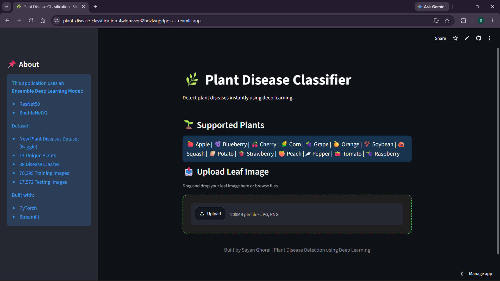
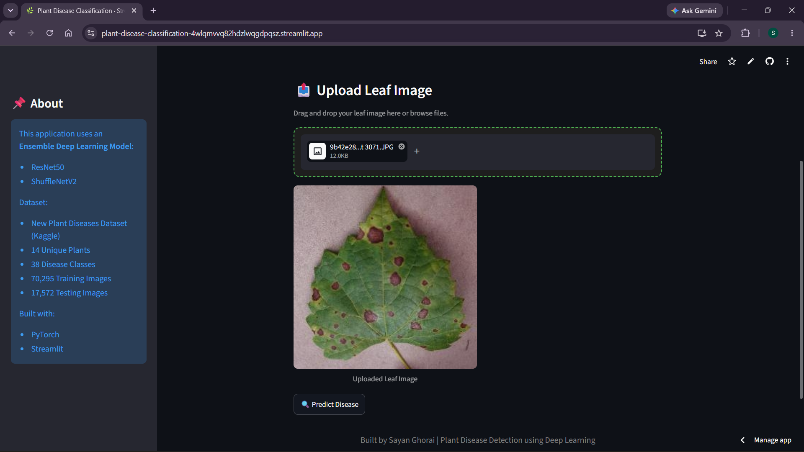
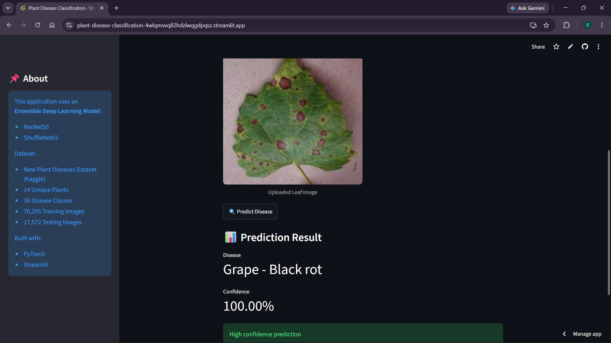
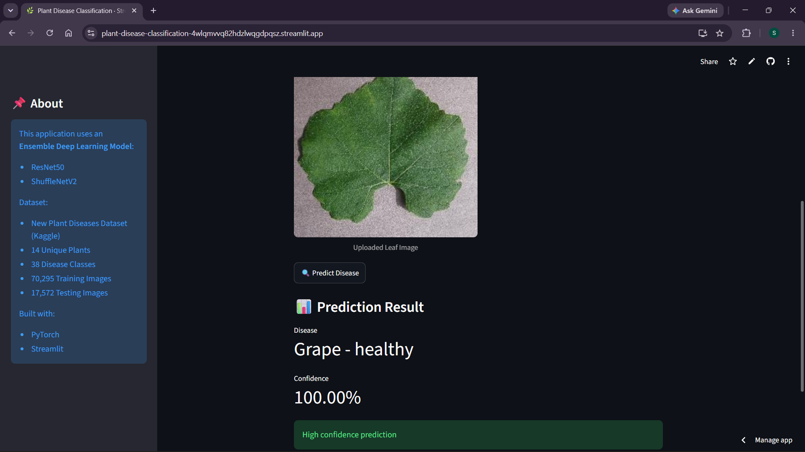

# 🌿 Plant Disease Classification

An AI-powered deep learning web application for plant disease detection using leaf images. This project uses an ensemble of **ResNet50** and **ShuffleNetV2** to classify plant diseases across multiple crop species.

## 🚀 Live Demo

**Streamlit App:**
https://plant-disease-classification-4wlqmvvq82hdzlwqgdpqsz.streamlit.app/

---

## 📌 Project Overview

Plant diseases can significantly reduce agricultural productivity. Early detection helps farmers take preventive action and improve crop health.

This project aims to classify plant diseases from leaf images using deep learning and provide instant predictions through a Streamlit web application.

Users can upload a plant leaf image and the model predicts the disease category with confidence score.

---

## 🧠 Model Architecture

This project uses an **Ensemble Deep Learning Model**:

- **ResNet50** for deep feature extraction
- **ShuffleNetV2** for lightweight feature extraction
- Feature concatenation from both models
- Fully connected layers for final classification

### Architecture Flow

Leaf Image → ResNet50 + ShuffleNetV2 → Feature Concatenation → Dense Layers → Disease Prediction

---

## 📂 Dataset

Dataset used: **New Plant Diseases Dataset (Kaggle)**

Dataset statistics:

- **14 Unique Plants**
- **38 Disease Classes**
- **70,295 Training Images**
- **17,572 Validation/Test Images**

Supported Plants:

- Apple
- Blueberry
- Cherry
- Corn
- Grape
- Orange
- Soybean
- Squash
- Potato
- Strawberry
- Peach
- Pepper
- Tomato
- Raspberry

---

## ⚙️ Training Details

- Image size: **224 × 224**
- Batch size: **32**
- Optimizer: **Adam**
- Loss Function: **CrossEntropyLoss**
- Early Stopping used
- Best model checkpoint saved automatically

### Performance

- **Validation Accuracy:** 99.13%
- **Test Accuracy:** 99.11%

---

## 🖥️ Project Preview

### Homepage



---

### Leaf Upload



---

### Disease Prediction



---

### Healthy Leaf Prediction



---

## 📁 Project Structure

```bash
Plant-Disease-Classification/
│── app.py
│── class_names.json
│── requirements.txt
│── README.md
│── assets/
│   ├── homepage.png
│   ├── upload_leaf.png
│   ├── prediction_disease.png
│   ├── prediction_healthy.png
```

---

## 🛠 Installation

Clone repository:

```bash
git clone https://github.com/SayanGhorai/Plant-Disease-Classification.git
cd Plant-Disease-Classification
```

Create virtual environment:

```bash
python -m venv venv
```

Activate environment:

```bash
venv\Scripts\activate
```

Install dependencies:

```bash
pip install -r requirements.txt
```

Run application:

```bash
streamlit run app.py
```

---

## 📥 Model Loading

The trained model file is stored externally on Google Drive due to GitHub file size limitations.

The application automatically downloads the model using **gdown** when needed.

---

## ⚠ Challenges

- Internet images may perform worse than dataset images due to **domain shift**
- Different lighting, background, and angles affect prediction quality
- Real-world images are more complex than controlled dataset images

---

## 🔮 Future Improvements

- Add Top-3 predictions
- Improve real-world image generalization
- Add leaf segmentation for background removal
- Deploy mobile-friendly version
- Expand dataset with more crop diseases

---

## 🧰 Tech Stack

- Python
- PyTorch
- Torchvision
- Streamlit
- PIL
- gdown

---

## 👨‍💻 Author

**Sayan Ghorai**
M.Tech in Artificial Intelligence and Data Science
